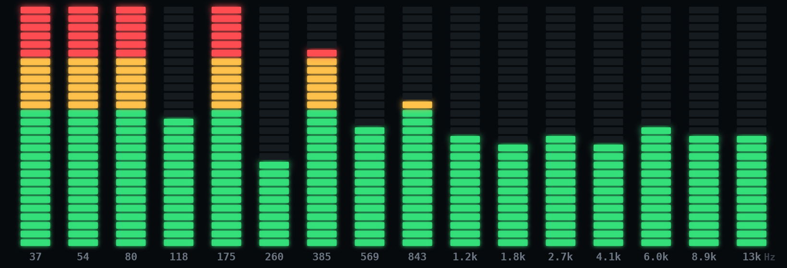

# SakiaVU

A real-time 16-band spectrum / VU meter for Linux desktop, written in C++ with GTK4 and Skia.



---

## Features

- 16 frequency bands — logarithmic scale, 30 Hz → 16 kHz
- 28 LED segments per band, colour-coded green / amber / red
- Peak hold with gravity-fall animation
- Adjustable input gain (0.1× – 1.5×)
- Real-time capture via **PipeWire** — microphone or system-output monitor
  ("what's playing"), with input/output device selection
- Physics playground overlay (**Box2D**): balls and boxes ride, bounce off, and
  get launched by the spectrum bars and held peak dots

## Requirements

| Dependency | Package (Arch / CachyOS) |
|---|---|
| GTK 4 | `gtk4` |
| PipeWire | `pipewire pipewire-alsa` |
| FFTW3 (float) | `fftw` |
| CMake ≥ 3.25 | `cmake` |
| Ninja | `ninja` |
| Skia m148 (prebuilt) | see below |
| Box2D v3.1.1 | fetched automatically by CMake (network needed on first configure) |

### Fetching the prebuilt Skia

Skia is vendored as a prebuilt static library (not committed to this repo). Download once:

```bash
mkdir -p third_party && cd third_party
curl -L -o skia.zip https://github.com/aseprite/skia/releases/download/m148-a29c8d23be/Skia-Linux-Release-x64.zip
mkdir skia && cd skia && bsdtar xf ../skia.zip && rm ../skia.zip
```

## Building

```bash
cmake -B build -G Ninja -DCMAKE_BUILD_TYPE=Release
cmake --build build
```

## Running

```bash
./build/sakia-vu
```

Pick **Mic** or **Output** mode (and a device, or keep the default), click
**Listen**, and use the **Gain** slider to adjust sensitivity. Toggle
**Peak Hold** to enable or disable the peak indicators.

Toggle **Physics** to reveal the playground controls — **Drop Ball**,
**Drop Box**, **Clear**, **Low Gravity** — or click the canvas to spawn a ball
(right-click for a box). The simulation keeps running while capture is stopped.

## Web port

A self-contained browser version lives in `web/index.html` — no build step, no
dependencies to install (matter-js loads from CDN). It replicates the native
app feature-for-feature: 16-band meter with peak hold and gain, mic or
tab/system-audio capture, and the physics playground (same gap-filler,
one-way-ledge, and `enforceSurface` anti-trap design).

```bash
cd web && python3 -m http.server
# open http://localhost:8000
```

Serving over http(s) (or localhost) is required — `getUserMedia` needs a
secure context, so opening the file directly won't work. **Tab audio** uses the
browser's share picker (`getDisplayMedia`): any tab/screen with audio on
Chromium, tab audio only on Firefox. The native DSP is a re-implementation of
the Web Audio `AnalyserNode`, so the web version uses the real thing with
identical settings (FFT 4096, smoothing 0.6, −100…−30 dB).

## Headless smoke tests

Render a synthetic multi-tone signal to a PNG — no display or microphone required:

```bash
cmake --build build --target render-test
./build/render-test /tmp/sakia-render.png
```

Exercise the physics world (bounds, eviction, and below-surface-trap asserts —
see [docs/PHYSICS.md](docs/PHYSICS.md)):

```bash
cmake --build build --target physics-test
./build/physics-test
```

## Project layout

```
src/
  app/                    — composition root and GTK application controller
  audio/                  — PipeWire audio source and FFTW spectrum analyzer
  core/interfaces/        — app-facing abstractions for DI
  core/models/            — shared state models
  physics/                — Box2D physics world for the playground overlay
  ui/                     — GTK meter widget and Skia renderer
tools/
  render_test.cpp         — Offscreen rendering smoke test
  physics_test.cpp        — Headless physics smoke test
docs/
  ARCHITECTURE.md         — Code structure and DI boundaries
  PHYSICS.md              — Physics collision design and anti-trap invariants
  ROADMAP.md              — Planned features and known constraints
```

See [docs/ARCHITECTURE.md](docs/ARCHITECTURE.md) for the current SOLID/DI layout and
dependency direction.

## Roadmap

See [docs/ROADMAP.md](docs/ROADMAP.md) for planned work including GPU rendering
(GtkGLArea + Skia Ganesh), stereo support, settings persistence, and packaging.

## License

MIT
