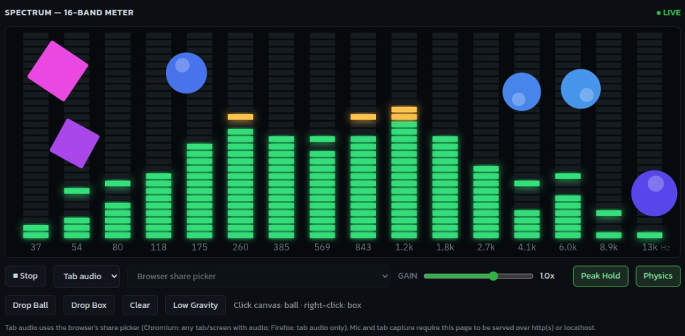

# SakiaVU — 16-Band Audio Spectrum Analyzer & VU Meter

**SakiaVU** is a high-performance web audio visualizer built with modern JavaScript, HTML5 Canvas, the Web Audio API, and 2D physics simulation (Matter.js). It renders a dynamic 16-band spectrum VU meter with peak hold mechanics, live gain control, multi-source audio capture, and interactive physics overlays.



---

## 🚀 Features

- **16-Band Spectrum Analyzer**: Logarithmically spaced frequency band analysis (calibrated for standard sample rates up to 48 kHz).
- **Smooth Meter Dynamics**: Instant level attack response paired with smooth frame-rate independent exponential release decay.
- **Peak Hold & Physics Decay**: Visual peak indicator bars with accelerating gravity-based falloff.
- **Flexible Audio Capture**:
  - **Microphone Input**: Live mic capture with real-time audio input device switching.
  - **Tab / System Audio**: Browser display media sharing (`getDisplayMedia`) to visualize web tab or desktop audio.
- **Live Gain Control**: Adjustable signal multiplier (0.1x to 1.5x) with immediate feedback.
- **Interactive 2D Physics World**: Powered by [Matter.js](https://brm.io/matter-js/). Objects (balls and boxes) can be dropped directly onto the audio spectrum bars, bouncing dynamically against physical surfaces that mirror the live VU meter levels.
- **High-DPI Rendering**: Canvas rendering dynamically scaled according to `window.devicePixelRatio` for sharp visuals on modern displays.
- **Modular & Lightweight**: Built with standard ES Modules (`.mjs`) with zero build steps required and graceful degradation if Matter.js is absent.

---

## 🛠 Project Architecture

The codebase follows a clear separation of concerns organized under `js/`:

```
SakiaVU/
├── index.html                  # Main web application entry point & layout
├── favicon.ico                 # Multi-resolution ICO app icon
├── css/
│   └── styles.css              # Dark theme styling and control layouts
├── docs/
│   └── screenshot.png          # Application interface preview image
├── js/
│   ├── main.mjs                # Application bootstrapper and dependency wiring
│   ├── app/
│   │   └── AppController.mjs   # Core event loop and frame orchestration
│   ├── audio/
│   │   ├── AudioCaptureService.mjs  # Web Audio API context and stream manager
│   │   ├── SpectrumAnalyzer.mjs     # FFT frequency bin calculation & band mapping
│   │   └── sources/
│   │       ├── MicrophoneSource.mjs # getUserMedia audio capture
│   │       └── TabAudioSource.mjs  # getDisplayMedia tab capture
│   ├── core/
│   │   └── MeterLayout.mjs     # Geometry math & 16-band layout definitions
│   ├── physics/
│   │   └── MatterPhysicsWorld.mjs   # Matter.js engine integration & dynamic bar collisions
│   ├── rendering/
│   │   └── MeterCanvasRenderer.mjs  # DPR-aware Canvas 2D spectrum renderer
│   └── ui/
│       └── AppView.mjs         # DOM interaction, control bindings, and status updates
└── tests/                      # Automated unit and architectural test suite
```

---

## 💻 Getting Started

### Prerequisites
- A modern web browser with **Web Audio API** and **Canvas 2D** support (Chrome, Edge, Firefox, Safari).
- Node.js (v18+) if you wish to run the test suite.

### Local Development
Audio capture APIs (`getUserMedia` / `getDisplayMedia`) require secure contexts (`https://`) or `localhost`.

To serve the project locally:

Using Python:
```bash
python3 -m http.server 8000
```

Using Node.js (`npx serve` or `http-server`):
```bash
npx serve .
```

Open your browser and navigate to `http://localhost:8000` (or the port specified by your static server).

---

## 🎮 How to Use

1. Click **▶ Listen** to start audio capture.
2. Select your desired **Capture Mode**:
   - **Mic**: Pick an available audio input device from the dropdown menu.
   - **Tab audio**: Use the browser share dialog to capture audio playing from another browser tab or application.
3. Adjust **GAIN** to scale input levels as needed.
4. Toggle **Peak Hold** to turn peak indicators on or off.
5. Toggle **Physics** to open the interactive 2D physics controls:
   - Click **Drop Ball** or **Drop Box** to spawn physics bodies.
   - Click directly on the meter canvas (**Left-click**: Ball, **Right-click**: Box) to drop objects at a specific location.
   - Toggle **Low Gravity** to alter physics behavior.
   - Click **Clear** to remove spawned objects.

---

## 🧪 Running Tests

The project includes unit and architecture tests powered by the native Node.js test runner (`node --test`).

Run the test suite:
```bash
npm test
```

### Test Coverage Highlights
- **Architecture**: Enforces functional coding patterns (e.g., `NoExplicitLoops.test.mjs`).
- **Audio Capture & Analysis**: Verifies stream lifecycle, track cleanup, and logarithmic frequency bin conversions.
- **Physics Engine**: Tests physical bar bound updates, safe spawn heights, and graceful fallback when Matter.js is uninitialized.
- **Canvas Renderer**: Verifies High-DPI scaling and rendering order.

---

## 📜 License

Private repository / Proprietary.
